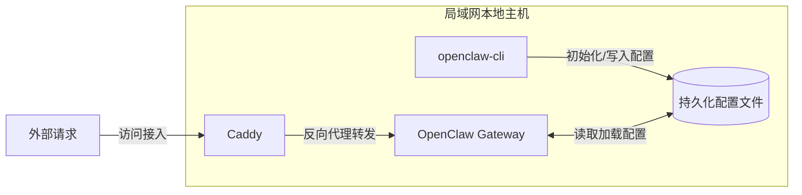

## 介绍
在 linux 上使用 docker-compose 来运行 openclaw
1. 环境可控
2. 方便部署
3. 安全边界可控

## 架构

openclaw-cli 初始环境之后可以关闭

## 搭建环境
1. VMware Workstation Pro 创建的虚拟机 debian 13
2. 安装 docker 和 docker-compose
3. 运行 openclaw.sh
```bash
bash openclaw.sh
# 或
sh openclaw.sh

# 详细调试模式
bash -v openclaw.sh
```

## 说明
1. openclaw.sh 是启动脚本，放置到用户目录下就行,启动会在用户目录创建相关配置文件夹和必要配置文件，并且自动拉取 openclaw 相关镜像, 用户目录下只需要有 openclaw.sh 就行, 其他文件都会自动创建

2. 初始化配置文件(命令行在openclaw.sh文件中查找就行)

3. 通过 docker compose 启动 openclaw


## 注意事项
本脚本只适合本地部署,不适合生产环境部署,生产环境部署会有安全风险!!!

docker-deploy.sh 是 [OpenClawChineseTranslation](https://github.com/1186258278/OpenClawChineseTranslation) 开源的汉化一键安装脚本